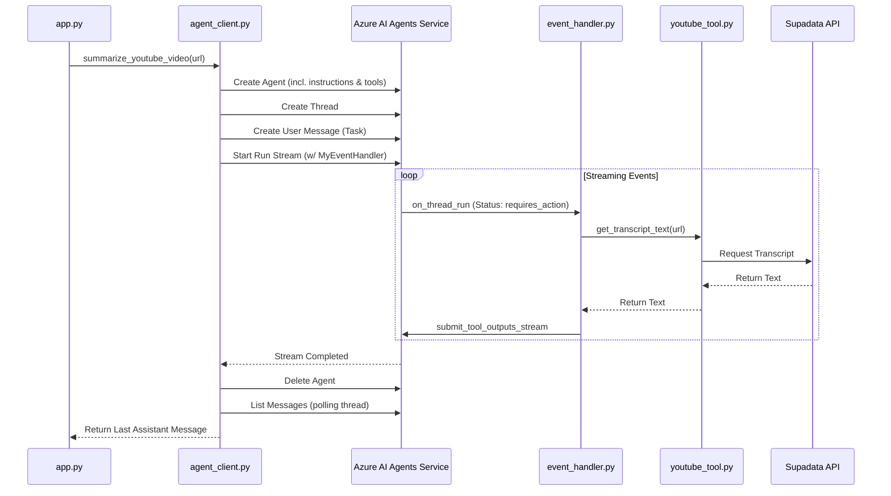

# Reverse-Engineered Technical Design (TDD-R): `agent_core`

This document decomposes the internal "black box" logic of the `agent_core` module, which orchestrates AI-driven YouTube summarization.

## 1. Core Logic Flow

The following flowchart visualizes the sequence of operations when `summarize_youtube_video()` is invoked.

### Detailed Step-by-Step:
1.  **Initialization:** The `AIProjectClient` is context-managed. An ephemeral agent is provisioned with a hardcoded instruction set and a reference to the `get_transcript_text` tool.
2.  **Communication Setup:** A new Thread is created (stateless interaction from the UI's perspective).
3.  **The Run:** The system initiates a stream. The execution logic shifts to the `MyEventHandler` class.
4.  **Tool Execution:** The event handler detects the `requires_action` state. It looks up the requested function name in its internal `functions` dictionary and executes it.
5.  **Data Retrieval:** The `youtube_tool` fetches the transcript via an external API.
6.  **Re-entry:** Tool results are submitted back to the Azure service, which may trigger further reasoning steps or final completion.
7.  **Cleanup:** The agent is deleted from the Azure environment. The thread's message history is retrieved, and the assistant's final response is extracted.

## 2. State Transitions

The module does not maintain a local database, but it drives state transitions in the Azure AI Agents ecosystem:

| Entity | State Transition | Trigger |
| :--- | :--- | :--- |
| **Agent** | `null` -> `Created` -> `Deleted` | `create_agent()` / `delete_agent()` |
| **Thread** | `null` -> `Empty` -> `Active` | `threads.create()` / `messages.create()` |
| **Run** | `queued` -> `in_progress` -> `requires_action` -> `completed` | `runs.stream()` lifecycle |

## 3. Error Handling & Edge Cases

### Current Handling Patterns
- **Global Suppression:** `summarize_youtube_video` uses a generic `try...except Exception` at the top level, which prints to stdout but allows the UI to catch the exception and show a warning.
- **Event Handler resilience:** In `on_thread_run`, individual tool calls are wrapped in `try...except`. If a tool fails, the error is printed, but no specific error output is sent back to the LLM for that tool call (potential for LLM confusion/infinite loop).
- **External API errors:** `youtube_tool.py` catches `SupadataError`, prints details, but implicitly returns `None`.

### Unchecked Exceptions & Crash Risk
- **Environment Mappings:** If `PROJECT_ENDPOINT` is missing, `agent_client.py` will crash immediately during `initialize_agent_client()` or during client setup inside the main function.
- **Malformed Tool Outputs:** If `supadata` returns something other than a string and the Azure SDK expects a string, the `ToolOutput` initialization might raise a type error.
- **Empty Message History:** If the stream completes but no assistant message was generated (e.g., due to a safety filter or run failure), the polling loop in `agent_client.py` will return the default string "No summary generated."

## 4. Hidden Dependencies

- **Hardcoded Instructions:** Line 21-26 of `agent_client.py` contains the entire "personality" and logic constraints of the system.
- **Supadata "Text" Mode:** The tool assumes `text=True` is always supported by the target video.
- **Credential Scope:** Relies on the user being logged in via Azure CLI (`az login`) with permissions corresponding to the `role.json` definition.

## 5. Complexity Analysis

- **`MyEventHandler.on_thread_run` (High Risk):** This function is recursive/re-entrant by nature because it calls `submit_tool_outputs_stream` and passes `self` back as the event handler for the *new* stream. Refactoring this requires deep understanding of the Azure AI streaming lifecycle.
- **`summarize_youtube_video` (High Risk):** This is a long-running, state-heavy function that manages four distinct Azure entities (Client, Agent, Thread, Message). It violates the Single Responsibility Principle and is the primary candidate for future decomposition.
