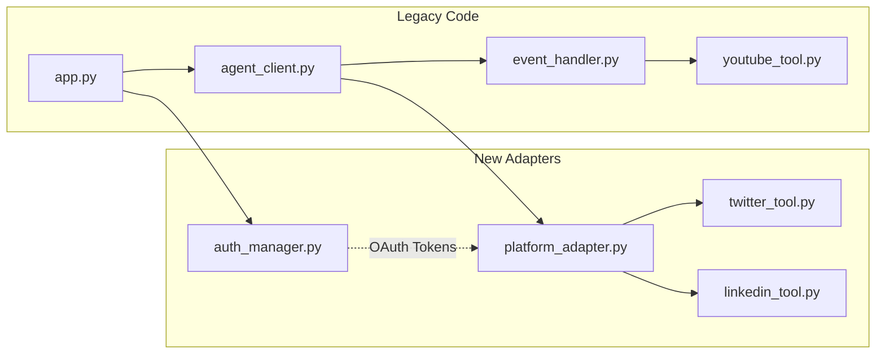

# Feature Implementation Design: Social Media Posting Integration

This document describes the implementation strategy for adding Twitter and LinkedIn posting capabilities to the YouTube Summarizer, including SSO authentication and logout functionality.

**Constraints Reference:**
- [agent_core-TDD-R.md](file:///Users/soyon/Projects/youtube-summerizer/.antigravity/designs/agent_core-TDD-R.md)
- [backend_api.md](file:///Users/soyon/Projects/youtube-summerizer/.antigravity/interfaces/backend_api.md)
- [frontend_lib.md](file:///Users/soyon/Projects/youtube-summerizer/.antigravity/interfaces/frontend_lib.md)

---

## Feature Overview

| # | Feature | Description | Status |
|:--|:--------|:------------|:-------|
| 1 | **Twitter-Optimized Summary + Post** | Generate a summary tailored for Twitter (≤280 chars, informal tone, hashtags) and post via API | ✅ Complete |
| 2 | **LinkedIn-Optimized Summary + Post** | Generate a summary tailored for LinkedIn (≤3000 chars, professional tone) and post via API | 🔲 Planned |
| 3 | **SSO Login (Twitter/LinkedIn)** | OAuth2 authentication flow for both platforms | ✅ Twitter / 🔲 LinkedIn |
| 4 | **Logout** | Token revocation and session cleanup | ✅ Twitter |

---

## Implementation Notes (Twitter - Complete)

> [!NOTE]
> The following learnings from Twitter implementation affect LinkedIn assumptions.

| Original Assumption | Actual Implementation | Impact on LinkedIn |
|:--------------------|:----------------------|:-------------------|
| Summary ≤280 chars is sufficient | LLM often exceeds limit; target **<150 chars** to leave room for URL + hashtags | LinkedIn may also need buffer; target **<2800 chars** |
| Session state persists across OAuth redirect | Streamlit session resets on redirect; need **global verifier registry** | LinkedIn OAuth must also use `_PENDING_AUTHS` pattern |
| `st.button` triggers OAuth | Button + link is two clicks; `st.link_button` is one click | Use `st.link_button` for LinkedIn too |
| Post immediately after summary | Users want to review; added **confirmation UI** (Post/Cancel) | LinkedIn needs same confirmation flow |
| No URL in summary | Users requested YouTube URL in post | Include source URL in LinkedIn posts too |

## 1. Integration Strategy

### Approach: **Adapter Pattern + Dependency Injection**

We will use an **Adapter pattern** to wrap new social media services without modifying the core `summarize_youtube_video()` logic. A **Dependency Injection** approach will pass platform-specific configuration at runtime.



### Key Design Decisions

| Decision | Rationale |
|:---------|:----------|
| **Do NOT modify `summarize_youtube_video()` signature** | Preserves the existing API contract per `backend_api.md` Line 11. Instead, create a new function `summarize_for_platform()`. |
| **Adapter wraps posting logic** | `platform_adapter.py` translates between the generic summary output and platform-specific posting APIs. |
| **OAuth tokens stored in `st.session_state`** | Aligns with `frontend_lib.md` Line 34-36 (`StreamlitSessionState` pattern). No database required. |
| **Instructions are injected, not hardcoded** | Addresses TDD-R Section 4 ("Hardcoded Instructions" concern) by making instructions a parameter. |

---

## 2. Refactor Requirements (Minimum Changes)

### 2.1 Backend Changes (`agent_core/`)

#### [MODIFY] [agent_client.py](file:///Users/soyon/Projects/youtube-summerizer/agent_core/agent_client.py)

| Line(s) | Current State | Minimum Change |
|:--------|:--------------|:---------------|
| 21-26 | `agent_instructions` is a hardcoded string | Extract to a **function** `get_instructions(platform: str = "default")` that returns platform-specific prompts |
| 30 | `def summarize_youtube_video(youtube_url: str):` | **Keep unchanged**. Add a _new_ function instead. |

**New function to add:**
```python
def summarize_for_platform(youtube_url: str, platform: str) -> str:
    """
    Wrapper that calls summarize logic with platform-specific instructions.
    platform: "default" | "twitter" | "linkedin"
    """
```

> [!IMPORTANT]
> The original `summarize_youtube_video()` MUST remain functional for backward compatibility.

---

#### [NEW] [platform_adapter.py](file:///Users/soyon/Projects/youtube-summerizer/agent_core/platform_adapter.py)

Responsibilities:
- Maps platform names to instruction templates
- Validates summary length against platform limits
- Orchestrates posting after summary generation

```python
PLATFORM_CONFIG = {
    "twitter": {
        "max_chars": 280,
        "tone": "casual, engaging, use hashtags",
        "post_function": "post_to_twitter"
    },
    "linkedin": {
        "max_chars": 3000,
        "tone": "professional, structured, use bullet points",
        "post_function": "post_to_linkedin"
    }
}
```

---

#### [NEW] [twitter_tool.py](file:///Users/soyon/Projects/youtube-summerizer/agent_core/twitter_tool.py)

Implements:
- `post_to_twitter(text: str, oauth_token: str) -> dict`
- Uses Twitter API v2 (`POST /2/tweets`)

---

#### [NEW] [linkedin_tool.py](file:///Users/soyon/Projects/youtube-summerizer/agent_core/linkedin_tool.py)

Implements:
- `post_to_linkedin(text: str, oauth_token: str, user_urn: str) -> dict`
- Uses LinkedIn Marketing API (`POST /ugcPosts`)

---

#### [NEW] [auth_manager.py](file:///Users/soyon/Projects/youtube-summerizer/agent_core/auth_manager.py)

Responsibilities:
- `get_oauth_url(platform: str) -> str` – generates OAuth2 authorization URL
- `exchange_code_for_token(platform: str, code: str) -> dict` – handles callback
- `revoke_token(platform: str, token: str) -> bool` – logout/cleanup
- `is_authenticated(platform: str, session_state: dict) -> bool` – checks session

---

### 2.2 Frontend Changes (`app.py`)

#### [MODIFY] [app.py](file:///Users/soyon/Projects/youtube-summerizer/app.py)

| Area | Current State | Minimum Change |
|:-----|:--------------|:---------------|
| Session State (Line 10) | Only `youtube_url` key | Add `twitter_token`, `linkedin_token`, `user_info` keys |
| UI Layout (Lines 14-18) | Single column with 2 buttons | Add platform selector dropdown + SSO buttons in sidebar |
| Service Call (Line 27) | Calls `summarize_youtube_video()` directly | Conditionally call `summarize_for_platform()` based on selection |

**New UI Components:**
```python
# Sidebar for authentication
with st.sidebar:
    st.header("🔐 Connect Accounts")
    if not st.session_state.get("twitter_token"):
        st.link_button("Login with Twitter", auth_manager.get_oauth_url("twitter"))
    else:
        st.success("✓ Twitter connected")
        if st.button("Logout Twitter"):
            auth_manager.revoke_token("twitter", st.session_state["twitter_token"])
            del st.session_state["twitter_token"]
```

---

### 2.3 Environment Variables (`.env`)

| Variable | Purpose |
|:---------|:--------|
| `TWITTER_CLIENT_ID` | Twitter OAuth2 App Client ID |
| `TWITTER_CLIENT_SECRET` | Twitter OAuth2 App Client Secret |
| `LINKEDIN_CLIENT_ID` | LinkedIn OAuth2 App Client ID |
| `LINKEDIN_CLIENT_SECRET` | LinkedIn OAuth2 App Client Secret |
| `OAUTH_REDIRECT_URI` | Callback URL (e.g., `http://localhost:8501/callback`) |

---

## 3. Validation Plan

### 3.1 Golden Path Test Cases

These are the critical paths that must pass to ensure zero regression:

| # | Test Case | Type | Pass Criteria |
|:--|:----------|:-----|:--------------|
| 1 | **Legacy Summarization** | Regression | `summarize_youtube_video(url)` returns valid summary string (unchanged behavior) |
| 2 | **Twitter Summary Generation** | Unit | `summarize_for_platform(url, "twitter")` returns string ≤280 chars |
| 3 | **LinkedIn Summary Generation** | Unit | `summarize_for_platform(url, "linkedin")` returns string ≤3000 chars |
| 4 | **Twitter OAuth Flow** | Integration | User can complete SSO, token is stored in `st.session_state["twitter_token"]` |
| 5 | **LinkedIn OAuth Flow** | Integration | User can complete SSO, token is stored in `st.session_state["linkedin_token"]` |
| 6 | **Twitter Post Success** | Integration | `post_to_twitter(text, token)` returns `{"id": "..."}` on valid input |
| 7 | **LinkedIn Post Success** | Integration | `post_to_linkedin(text, token, urn)` returns success response |
| 8 | **Logout Clears Session** | Unit | After logout, `is_authenticated(platform, session_state)` returns `False` |
| 9 | **Error Handling: Invalid Token** | Negative | Expired/revoked token returns clear error, does not crash app |
| 10 | **Error Handling: Rate Limit** | Negative | API rate limit response is caught and displayed to user |

---

### 3.2 Test Commands

> [!NOTE]
> No existing test suite was found in the repository. Tests will need to be created.

#### Manual Verification Steps (User Required)

**Test 1: Legacy Summarization Regression**
```bash
cd /Users/soyon/Projects/youtube-summerizer
streamlit run app.py
# 1. Enter any valid YouTube URL
# 2. Click "Summarize Video"
# 3. Verify summary text appears
```

**Test 4 & 5: OAuth Flow**
```bash
# 1. Run app with `streamlit run app.py`
# 2. Click "Login with Twitter" in sidebar
# 3. Complete OAuth in browser popup
# 4. Verify "✓ Twitter connected" appears
# 5. Repeat for LinkedIn
```

**Test 6 & 7: Posting**
```bash
# 1. After OAuth, enter YouTube URL and select "Twitter" as target
# 2. Click "Summarize & Post"
# 3. Verify success message and check Twitter/LinkedIn for posted content
```

#### Proposed Automated Tests

Create `/Users/soyon/Projects/youtube-summerizer/tests/test_platform_adapter.py`:
```python
def test_twitter_summary_length():
    """Verify Twitter summary respects 280 char limit"""
    
def test_linkedin_summary_length():
    """Verify LinkedIn summary respects 3000 char limit"""
    
def test_legacy_function_unchanged():
    """Verify original summarize_youtube_video still works"""
```

---

## 4. Risk Assessment

| Risk | Impact | Mitigation |
|:-----|:-------|:-----------|
| OAuth token expiry mid-session | User sees cryptic error | Implement token refresh logic in `auth_manager.py` |
| Twitter rate limits (50 posts/day) | Silent failure | Display rate limit info in UI, queue posts |
| LLM generates summary > char limit | Post fails | Validate length before posting; re-prompt if needed |
| Breaking `summarize_youtube_video` contract | Existing integrations fail | Keep function signature unchanged; add new functions only |

---

## 5. File Change Summary

| File | Action | Complexity |
|:-----|:-------|:-----------|
| `agent_core/agent_client.py` | MODIFY | Medium |
| `agent_core/platform_adapter.py` | NEW | Low |
| `agent_core/twitter_tool.py` | NEW | Medium |
| `agent_core/linkedin_tool.py` | NEW | Medium |
| `agent_core/auth_manager.py` | NEW | High |
| `app.py` | MODIFY | Medium |
| `.env` | MODIFY | Low |
| `tests/test_platform_adapter.py` | NEW | Low |
